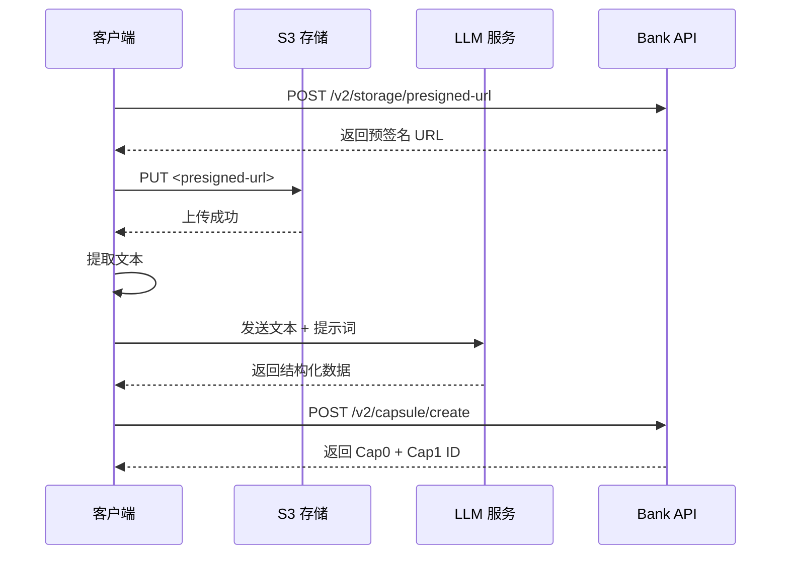

# API 版本化说明

## 路由结构

### 传统路由（向后兼容，无版本前缀）
```
GET  /capsule/{id}              - 获取胶囊
POST /capsule/                  - 创建胶囊
GET  /capsule/owner/{owner_id}  - 获取所有者的胶囊
GET  /capsule/search            - 搜索胶囊

POST /auth/grant                - 授予权限
POST /auth/use                  - 使用令牌
POST /auth/revoke               - 撤销权限
GET  /auth/list                 - 列出权限
```

### V1 API（显式版本）
```
GET  /v1/capsule/{id}              - 获取胶囊
POST /v1/capsule/                  - 创建胶囊
GET  /v1/capsule/owner/{owner_id}  - 获取所有者的胶囊
GET  /v1/capsule/search            - 搜索胶囊

POST /v1/auth/grant                - 授予权限
POST /v1/auth/use                  - 使用令牌
POST /v1/auth/revoke               - 撤销权限
GET  /v1/auth/list                 - 列出权限
```

### V2 API（新功能）

#### 胶囊管理
```
POST /v2/capsule/upload         - 上传文件并创建完整胶囊（Cap0 + Cap1）【完全托管】
POST /v2/capsule/create         - 创建胶囊（外部化方案）【推荐】⭐
```

#### 存储辅助
```
POST /v2/storage/presigned-url  - 生成 S3 预签名 URL
```

## 代码结构

```
src/
├── handlers/
│   ├── mod.rs           # 导出 v1 和 v2，并为向后兼容重新导出 v1
│   ├── v1/              # V1 handlers
│   │   ├── mod.rs
│   │   ├── capsule.rs   # V1 胶囊处理
│   │   └── authorization.rs  # V1 授权处理
│   └── v2/              # V2 handlers
│       ├── mod.rs
│       └── capsule.rs   # V2 胶囊处理（文件上传）
│
├── routes/
│   ├── mod.rs           # 主路由配置
│   ├── capsule.rs       # 传统路由（向后兼容）
│   ├── authorization.rs # 传统路由（向后兼容）
│   ├── v1/              # V1 routes
│   │   ├── mod.rs
│   │   ├── capsule.rs
│   │   └── authorization.rs
│   └── v2/              # V2 routes
│       ├── mod.rs
│       └── capsule.rs
```

## 访问 Swagger UI

启动服务器后访问：
```
http://localhost:8080/swagger-ui
```

所有 API 文档都会在 Swagger UI 中展示，包括：
- 传统路由（无版本前缀）
- V1 API
- V2 API

## 开发指南

### 添加新的 V2 端点

1. 在 `src/handlers/v2/` 中添加 handler 函数
2. 在 `src/routes/v2/` 中添加路由配置
3. 使用 `#[utoipa::path]` 标注生成 OpenAPI 文档

### 示例：V2 Upload Handler

```rust
// src/handlers/v2/capsule.rs
#[utoipa::path(
    post,
    path = "/upload",
    request_body(content = UploadRequest, content_type = "multipart/form-data"),
    responses(
        (status = 201, description = "Capsule created", body = UploadResponse),
    ),
    tag = "Capsule V2"
)]
pub async fn upload_and_create_capsule(
    // ... implementation
) -> Result<Json<UploadResponse>> {
    // ...
}
```

## V2 API 详细说明

### POST /v2/capsule/create（推荐）⭐

**描述**: 创建胶囊（外部化方案）

**适用场景**:
- 生产环境
- 大文件（> 10MB）
- 复杂文档类型
- 需要 LLM 处理

**客户端职责**:
1. （可选）从 PKI 服务器获取所有者证书
2. （可选）生成 DEK 并加密文件，用公钥加密 DEK
3. 上传文件到 S3（加密或未加密）
4. 使用 LLM 提取结构化数据
5. 调用此 API 创建胶囊（附带加密信息）

**Bank 职责**:
1. 验证数据完整性
2. 封装 Cap0 + Cap1
3. 保存到数据库（包括加密元数据）

**加密说明**:
- `encryption` 字段为可选，支持加密和非加密两种模式
- 使用 PKI 混合加密：AES-256-GCM（文件）+ RSA-OAEP（DEK）
- Bank 不存储解密密钥，保证端到端隐私
- 详细加密流程见 [ARCHITECTURE.md](./ARCHITECTURE.md)

**请求示例（带 PKI 加密）**:
```json
POST /v2/capsule/create
Content-Type: application/json

{
    "cap0": {
        "external_url": "https://s3.amazonaws.com/bucket/report.pdf.enc",
        "origin_text_url": "https://s3.amazonaws.com/bucket/report.txt",
        "encryption": {
            "algorithm": "AES-256-GCM",
            "encrypted_dek": "base64_encoded_encrypted_dek...",
            "nonce": "base64_encoded_nonce...",
            "tag": "base64_encoded_tag...",
            "key_owner": "user123",
            "rsa_padding": "RSA-OAEP-SHA256"
        }
    },
    "cap1": {
        "metadata": {
            "filename": "blood_test_report.pdf",
            "size": 1024000,
            "mime_type": "application/pdf",
            "hash": "sha256:abcd1234...",
            "created_at": 1705334400,
            "modified_at": 1705334400,
            "extra": {}
        },
        "structured_data": {
            "patient_id": "P123456",
            "test_date": "2025-01-15",
            "test_type": "blood_test",
            "results": [
                {
                    "item": "白细胞",
                    "value": "5.2",
                    "unit": "10^9/L",
                    "status": "normal"
                }
            ]
        }
    },
    "owner_id": "user123",
    "content_type": "medical.blood_test",
    "policy_uri": "https://example.com/policy",
    "permissions": ["read", "share"],
    "creator": "hospital_system"
}
```

**响应示例**:
```json
{
    "success": true,
    "cap0_id": "cid:xxxxx",
    "cap1_id": "cid:yyyyy",
    "storage_url": "https://s3.amazonaws.com/bucket/report.pdf",
    "created_at": 1705334400,
    "message": "Capsule created successfully"
}
```

### POST /v2/storage/presigned-url

**描述**: 生成 S3 预签名 URL

**用途**: 客户端获取预签名 URL 用于直接上传文件到 S3

**请求示例**:
```json
POST /v2/storage/presigned-url
Content-Type: application/json

{
    "filename": "report.pdf",
    "content_type": "application/pdf",
    "size": 1024000,
    "expires_in": 3600
}
```

**响应示例**:
```json
{
    "upload_url": "https://s3.amazonaws.com/bucket/key?signature=...",
    "object_key": "user123/2025-01-15/report.pdf",
    "expires_at": 1705338000,
    "max_size": 104857600
}
```

### POST /v2/capsule/upload（兼容）

**描述**: 上传文件并创建完整胶囊（完全托管）

**适用场景**:
- 快速原型
- 小文件（< 10MB）
- 简单文本文档

**请求**: multipart/form-data
- `file`: 文件二进制
- `owner_id`: 所有者 ID
- `content_type`: 内容类型
- `creator`: 创建者（可选）

**注意**: 此 API 性能较差，推荐使用 `/v2/capsule/create`

## 完整工作流程示例

### 推荐流程（外部化方案）



## 下一步工作

V2 API 已完成核心功能：

✅ 1. POST /v2/capsule/create - 外部化创建 API
✅ 2. POST /v2/storage/presigned-url - 预签名 URL 生成
✅ 3. POST /v2/capsule/upload - 完全托管上传（兼容）

待完成：

📝 1. Cap0 完整封装实现（需要重新设计文件路径处理）
📝 2. S3 真实预签名 URL 生成（需要 AWS SDK 集成）
📝 3. 数据库集成（保存 Cap0 和 Cap1）
📝 4. 文件哈希验证
📝 5. 单元测试和集成测试

详见 [ARCHITECTURE.md](./ARCHITECTURE.md) 了解完整架构设计。
