# Capsula Bank 架构设计文档

## 目录
- [PKI 证书申请流程](#pki-证书申请流程)
- [系统架构概览](#系统架构概览)
- [当前实现流程](#当前实现流程)
- [推荐架构流程](#推荐架构流程)
- [功能外部化分析](#功能外部化分析)
- [API 设计](#api-设计)
- [组件职责划分](#组件职责划分)

---

## PKI 证书申请流程

### 方案 1: 极简方案（推荐）⭐

**设计理念**：客户端零密码学操作，一次 API 调用完成所有流程。

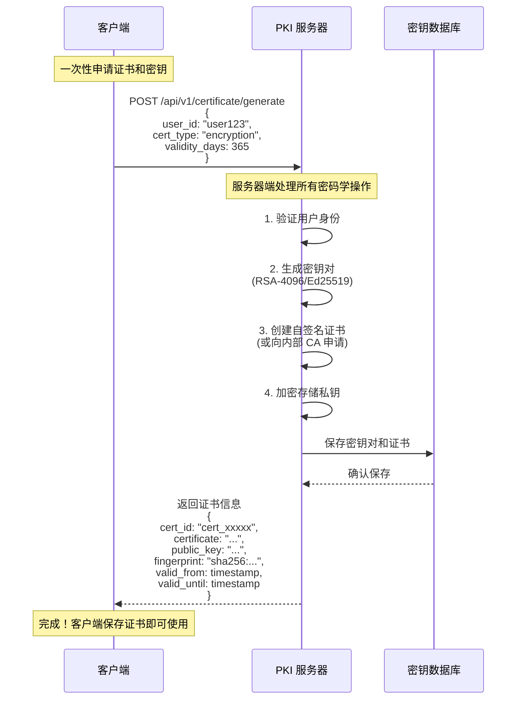

**极简方案 API 设计**：

```typescript
// 请求
POST /api/v1/certificate/generate
Content-Type: application/json
Authorization: Bearer <auth_token>

{
    "user_id": "user123",
    "cert_type": "encryption",  // 或 "signing"
    "validity_days": 365        // 可选，默认 365 天
}

// 响应
{
    "cert_id": "cert_xxxxx",
    "certificate": "-----BEGIN CERTIFICATE-----\n...",
    "public_key": "-----BEGIN PUBLIC KEY-----\n...",
    "fingerprint": "sha256:abcd1234...",
    "valid_from": 1705334400,
    "valid_until": 1736870400,
    "algorithm": "RSA-4096",
    "key_usage": ["keyEncipherment", "dataEncipherment"]
}
```

**极简方案优势**：

```
✅ 客户端零密码学操作
   - 无需生成密钥对
   - 无需创建 CSR
   - 无需处理证书格式

✅ 一次 API 调用完成
   - 同步返回结果
   - 无需轮询状态
   - 即时可用

✅ 服务器端安全托管
   - 私钥加密存储
   - 统一密钥管理
   - 支持密钥恢复

✅ 简化客户端开发
   - 降低技术门槛
   - 减少错误可能
   - 加快集成速度
```

**使用示例**：

```typescript
// TypeScript 客户端
async function getCertificate(userId: string) {
    const response = await fetch('https://pki.example.com/api/v1/certificate/generate', {
        method: 'POST',
        headers: {
            'Content-Type': 'application/json',
            'Authorization': `Bearer ${authToken}`
        },
        body: JSON.stringify({
            user_id: userId,
            cert_type: 'encryption',
            validity_days: 365
        })
    });

    const cert = await response.json();

    // 保存证书信息到本地
    localStorage.setItem('certificate', cert.certificate);
    localStorage.setItem('public_key', cert.public_key);
    localStorage.setItem('cert_id', cert.cert_id);

    return cert;
}
```

```python
# Python 客户端
import requests

def get_certificate(user_id: str, auth_token: str):
    response = requests.post(
        'https://pki.example.com/api/v1/certificate/generate',
        headers={
            'Content-Type': 'application/json',
            'Authorization': f'Bearer {auth_token}'
        },
        json={
            'user_id': user_id,
            'cert_type': 'encryption',
            'validity_days': 365
        }
    )

    cert = response.json()

    # 保存证书信息
    with open('certificate.pem', 'w') as f:
        f.write(cert['certificate'])
    with open('public_key.pem', 'w') as f:
        f.write(cert['public_key'])

    return cert
```

---

### 方案 2: 标准方案（传统 PKI 流程）

**设计理念**：遵循传统 PKI 标准，客户端管理密钥对。

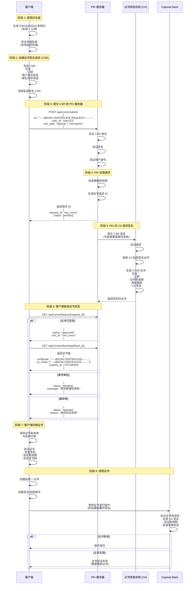

**标准方案特点**：

```
✅ 符合 PKI 标准
   - 遵循 X.509 规范
   - 支持证书链验证
   - 兼容 OpenSSL 工具

✅ 客户端掌控私钥
   - 私钥不离开客户端
   - 符合零信任架构
   - 适合高安全场景

❌ 实现复杂
   - 需要客户端密码学库
   - 需要处理证书格式
   - 需要管理密钥存储

❌ 集成门槛高
   - 需要理解 PKI 概念
   - 需要处理多步流程
   - 容易出错
```

---

### 方案对比

| 特性 | 极简方案 | 标准方案 |
|------|---------|---------|
| 客户端复杂度 | 极低（一次 API 调用） | 高（多步 PKI 流程） |
| 集成速度 | 快（< 1 小时） | 慢（1-3 天） |
| 私钥管理 | 服务器托管 | 客户端管理 |
| 安全级别 | 高（服务器端加密） | 极高（零信任） |
| 密钥恢复 | 支持 | 不支持 |
| 技术门槛 | 低 | 高 |
| 适用场景 | 大多数应用 | 高安全要求 |
| 推荐度 | ⭐⭐⭐⭐⭐ | ⭐⭐⭐ |

**选择建议**：
- **默认推荐极简方案**：适合 90% 的使用场景
- **高安全场景使用标准方案**：如政府、军事、金融核心系统

---

### 方案 2 详细说明（标准 PKI 流程）

#### 1. 密钥对生成（客户端）

```bash
# 使用 OpenSSL 生成 RSA 密钥对
openssl genrsa -out private_key.pem 4096

# 或使用 Ed25519 (更现代)
openssl genpkey -algorithm ED25519 -out private_key.pem

# 提取公钥
openssl rsa -in private_key.pem -pubout -out public_key.pem
```

**注意**：
- 私钥必须安全存储，建议使用密码加密
- 公钥将包含在 CSR 中提交给 PKI

#### 2. 创建 CSR（证书签名请求）

```bash
# 生成 CSR
openssl req -new -key private_key.pem -out cert_request.csr \
    -subj "/C=CN/ST=Beijing/L=Beijing/O=Hospital/OU=IT/CN=user123"

# 查看 CSR 内容
openssl req -in cert_request.csr -noout -text
```

**CSR 包含的信息**：
- **公钥**：用于加密/验证签名
- **Subject**：申请者身份信息
  - C: 国家代码
  - ST: 州/省
  - L: 城市
  - O: 组织
  - OU: 部门
  - CN: 通用名称（用户名/域名）
- **签名**：使用私钥对 CSR 内容签名

#### 3. 提交 CSR 到 PKI 服务器

**API 请求示例**：

```typescript
// TypeScript 客户端示例
async function submitCSR(csrPem: string, userId: string) {
    const response = await fetch('https://pki.example.com/api/csr/submit', {
        method: 'POST',
        headers: {
            'Content-Type': 'application/json',
            'Authorization': `Bearer ${authToken}`
        },
        body: JSON.stringify({
            csr: csrPem,
            user_id: userId,
            cert_type: 'signing',  // 或 'encryption'
            validity_days: 365,    // 可选：证书有效期
            key_usage: ['digitalSignature', 'keyEncipherment']
        })
    });

    const result = await response.json();
    // { request_id: "req_xxxxx", status: "pending" }
    return result;
}
```

#### 4. PKI 服务器处理

PKI 服务器收到 CSR 后的处理步骤：

```
1. 验证 CSR 格式
   ✓ 检查 PEM 格式
   ✓ 解析 ASN.1 结构

2. 验证签名
   ✓ 使用 CSR 中的公钥验证签名
   ✓ 确保 CSR 未被篡改

3. 验证用户身份
   ✓ 检查 user_id 是否存在
   ✓ 验证身份认证令牌
   ✓ 检查用户权限

4. 策略检查
   ✓ 检查证书类型限制
   ✓ 验证有效期限制
   ✓ 检查密钥强度

5. 创建证书请求记录
   ✓ 保存 CSR 到数据库
   ✓ 生成请求 ID
   ✓ 设置状态为 "pending"
```

#### 5. CA 签名证书

**CA 签名流程**：

```bash
# CA 使用自己的私钥签名证书
openssl x509 -req -in cert_request.csr \
    -CA ca_cert.pem -CAkey ca_private.pem \
    -CAcreateserial -out user_cert.pem \
    -days 365 -sha256 \
    -extensions v3_ext -extfile openssl.cnf
```

**生成的证书包含**：
- **版本**：X.509 v3
- **序列号**：唯一标识符
- **签名算法**：如 sha256WithRSAEncryption
- **颁发者**：CA 的 Distinguished Name
- **有效期**：起始时间和过期时间
- **主体**：证书持有者信息
- **公钥**：用户的公钥
- **扩展**：
  - Key Usage：证书用途（签名、加密等）
  - Extended Key Usage：扩展用途
  - Subject Alternative Name：备用名称
- **CA 签名**：CA 私钥的签名

#### 6. 客户端下载证书

```typescript
// 查询证书状态
async function checkCertStatus(requestId: string) {
    const response = await fetch(
        `https://pki.example.com/api/cert/status/${requestId}`
    );
    return await response.json();
    // { status: "approved", cert_id: "cert_xxxxx" }
}

// 下载证书
async function downloadCert(certId: string) {
    const response = await fetch(
        `https://pki.example.com/api/cert/download/${certId}`
    );
    const certData = await response.json();
    /*
    {
        certificate: "-----BEGIN CERTIFICATE-----\n...",
        ca_chain: [
            "-----BEGIN CERTIFICATE-----\n...",  // Intermediate CA
            "-----BEGIN CERTIFICATE-----\n..."   // Root CA
        ],
        expires_at: 1767235200
    }
    */
    return certData;
}
```

#### 7. 证书验证

```typescript
// 验证证书
async function verifyCertificate(certPem: string, caCertPem: string) {
    // 使用 OpenSSL 或 crypto 库验证
    // 1. 验证签名
    // 2. 检查有效期
    // 3. 验证证书链
    // 4. 检查吊销状态 (CRL/OCSP)
}
```

#### 8. 使用证书

**在 Capsula Bank 中使用证书**：

```typescript
// 加载证书和私钥
const privateKey = await loadPrivateKey('private_key.pem');
const certificate = await loadCertificate('user_cert.pem');

// 创建胶囊时使用证书签名
const capsuleData = {
    cap0: { external_url: '...' },
    cap1: { metadata: {...}, structured_data: {...} },
    owner_id: 'user123',
    content_type: 'medical.blood_test'
};

// 使用私钥签名
const signature = await signData(capsuleData, privateKey);

// 附加证书到请求
const response = await fetch('https://bank.example.com/v2/capsule/create', {
    method: 'POST',
    headers: {
        'Content-Type': 'application/json',
        'X-Client-Certificate': certificate,
        'X-Client-Signature': signature
    },
    body: JSON.stringify(capsuleData)
});
```

### PKI API 端点汇总

#### 极简方案 API

```
POST   /api/v1/certificate/generate      - 一次性生成证书和密钥（推荐）
GET    /api/v1/certificate/{cert_id}     - 获取证书信息
GET    /api/v1/certificate/list          - 列出用户的所有证书
POST   /api/v1/certificate/revoke        - 吊销证书
POST   /api/v1/decrypt                   - 解密 DEK（使用托管私钥）
GET    /api/v1/verify/{fingerprint}      - 验证证书有效性
```

#### 标准方案 API

```
POST   /api/v1/csr/submit                - 提交证书签名请求（CSR）
GET    /api/v1/cert/status/{request_id}  - 查询证书申请状态
GET    /api/v1/cert/download/{cert_id}   - 下载签名的证书
GET    /api/v1/cert/list                 - 列出用户的证书
POST   /api/v1/cert/revoke               - 吊销证书
GET    /api/v1/cert/verify               - 验证证书有效性
GET    /api/v1/ca/chain                  - 获取 CA 证书链
```

#### 通用 API

```
GET    /api/v1/ca/certificate            - 获取 CA 根证书
GET    /api/v1/health                    - 健康检查
GET    /api/v1/info                      - 服务信息
```

### 证书生命周期管理

#### 极简方案生命周期

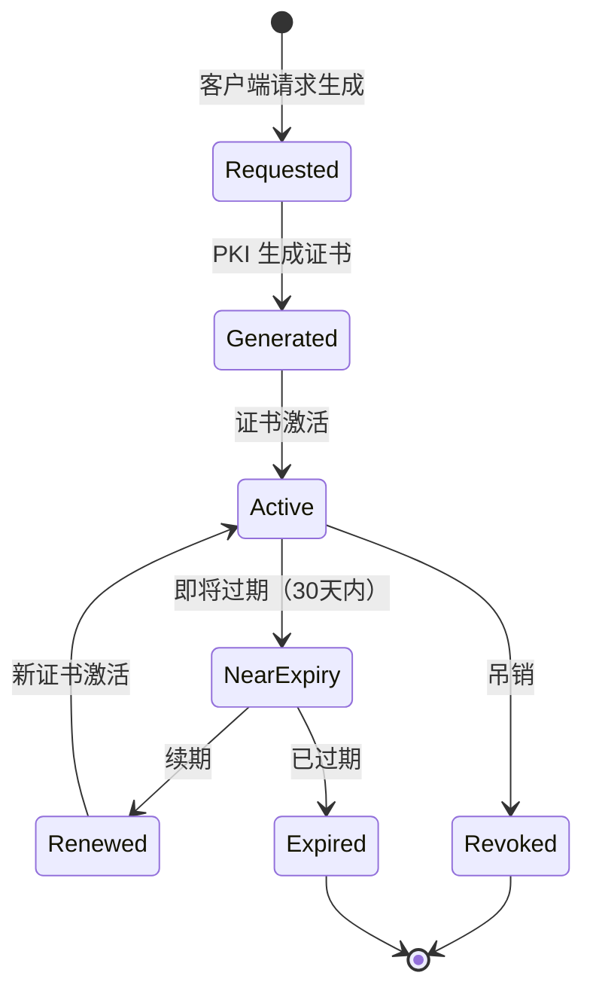

**极简方案特点**：
- 即时生成，无需等待审批
- 自动续期机制
- 统一密钥管理

#### 标准方案生命周期

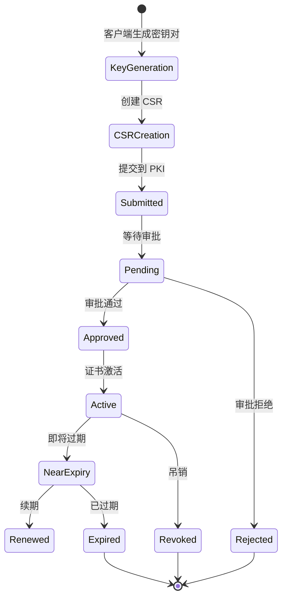

**标准方案特点**：
- 需要审批流程
- 客户端管理密钥
- 符合传统 PKI 标准

### 证书更新流程

#### 极简方案更新流程

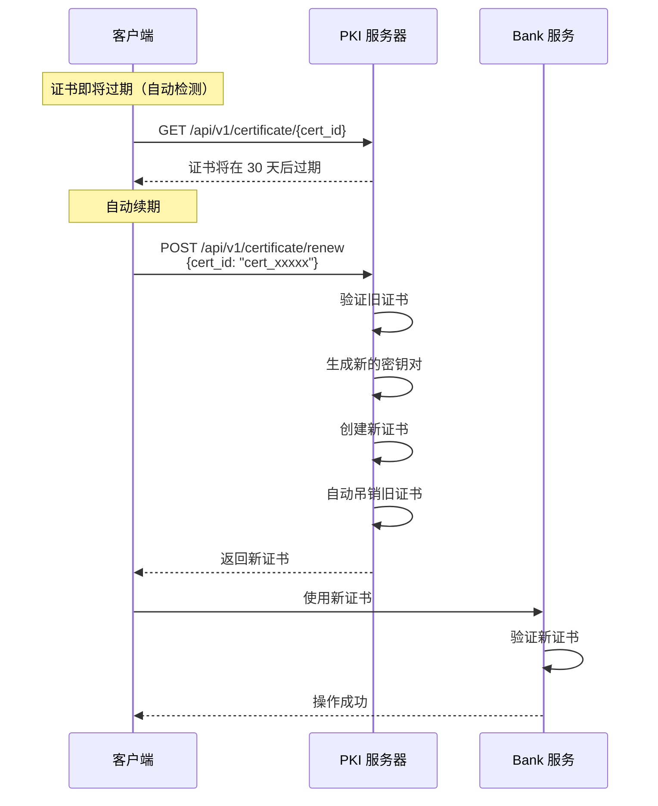

**极简方案续期 API**：

```typescript
// 续期请求
POST /api/v1/certificate/renew
{
    "cert_id": "cert_xxxxx",
    "validity_days": 365  // 可选
}

// 响应
{
    "old_cert_id": "cert_xxxxx",
    "new_cert_id": "cert_yyyyy",
    "certificate": "-----BEGIN CERTIFICATE-----...",
    "public_key": "-----BEGIN PUBLIC KEY-----...",
    "valid_from": 1705334400,
    "valid_until": 1736870400,
    "revoked_old_cert": true
}
```

#### 标准方案更新流程

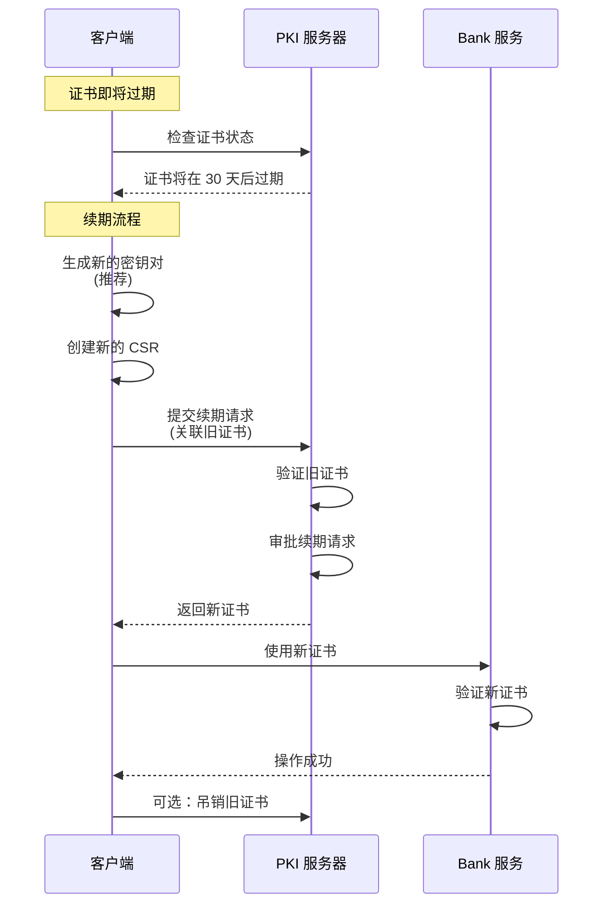

---

## 系统架构概览

### 核心概念

**Capsula Bank** 是一个胶囊管理服务，负责：
1. 接收和管理加密数据胶囊（Capsule）
2. 支持两层数据结构：Cap0（外部存储）+ Cap1（内联元数据）
3. 使用银行系统密钥进行统一加密
4. 提供权限管理和访问控制

---

## 当前实现流程

### V2 Upload API - 完全托管模式

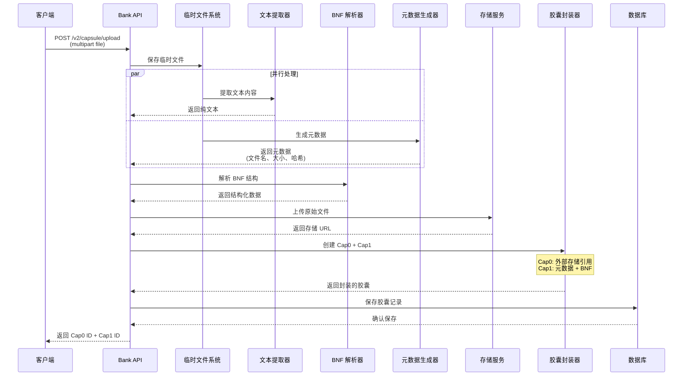

### 当前流程的问题

```
❌ 问题 1: 文件中转
   客户端 → Bank 服务器 → S3
   导致带宽浪费和延迟增加

❌ 问题 2: BNF 解析局限
   SimpleBnfParser 只能处理简单语法
   无法理解自然语言文档

❌ 问题 3: 扩展性差
   新增文档类型需要修改 Bank 代码
   PDF、Word 等格式需要重量级依赖

❌ 问题 4: 性能瓶颈
   所有处理都在 Bank 服务器完成
   大文件上传占用服务器资源
```

---

## 推荐架构流程

### 方案 A: 完全外部化（生产推荐）⭐

**使用极简 PKI 方案**：客户端零密码学操作，服务器托管密钥。

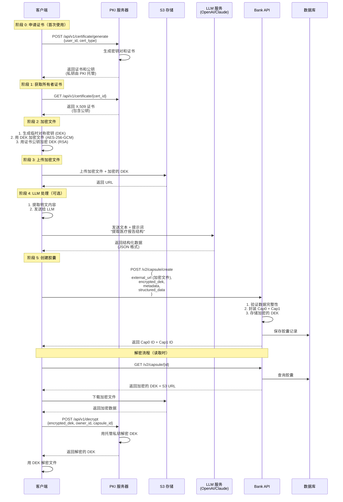

**方案 A 特点**：
- ✅ 使用极简 PKI 方案（服务器托管密钥）
- ✅ 客户端零密码学操作（除了文件加密）
- ✅ 端到端加密（S3 只存储密文）
- ✅ 快速集成（< 1 小时）
- ✅ 支持密钥恢复

### 方案 B: 混合模式（灵活）

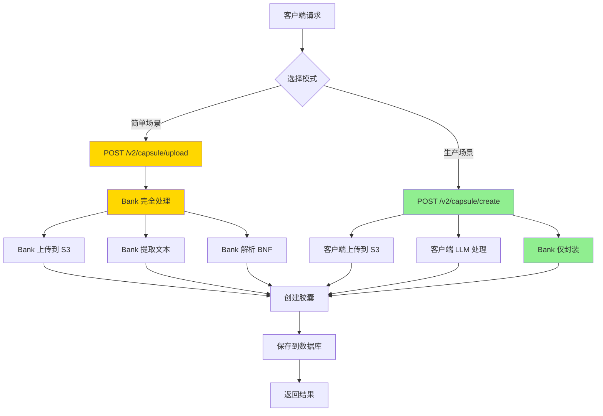

---

## 加密流程详解

### PKI 服务器集成

#### 为什么需要 PKI 服务器？

```
问题：直接上传明文到 S3
❌ S3 管理员可以读取
❌ 数据泄露风险高
❌ 不符合零信任架构

解决：客户端加密后上传
✅ 端到端加密
✅ S3 只存储密文
✅ 只有所有者可以解密
```

#### 加密方案：混合加密

```
1. 对称加密（性能）
   算法: AES-256-GCM
   用途: 加密大文件
   密钥: 临时 DEK (Data Encryption Key)

2. 非对称加密（安全）
   算法: RSA-2048/4096
   用途: 加密 DEK
   公钥: 从 PKI 服务器获取
   私钥: 由 PKI 服务器托管
```

### 详细加密流程

#### 上传流程

```
步骤 1: 获取证书（极简方案）
┌─────────┐              ┌─────────────┐
│ 客户端   │─────────────>│ PKI 服务器   │
│         │              │             │
│         │  GET /api/   │ 1. 验证身份  │
│         │  v1/certif-  │ 2. 返回证书  │
│         │  icate/      │             │
│         │  {cert_id}   │             │
│         │              │             │
│         │<─────────────│ X.509 Cert  │
└─────────┘              └─────────────┘

返回：
{
  "cert_id": "cert_xxxxx",
  "certificate": "-----BEGIN CERTIFICATE-----...",
  "public_key": "-----BEGIN PUBLIC KEY-----...",
  "fingerprint": "sha256:abcd1234...",
  "owner_id": "user123",
  "valid_from": 1705334400,
  "valid_until": 1736870400,
  "algorithm": "RSA-4096"
}

步骤 2: 客户端加密
┌─────────────────────────────────┐
│         客户端本地操作            │
├─────────────────────────────────┤
│                                 │
│ 1. 生成随机 DEK (32 bytes)      │
│    DEK = random_bytes(32)       │
│                                 │
│ 2. 用 DEK 加密文件              │
│    Ciphertext = AES-256-GCM(    │
│        plaintext: file_data,    │
│        key: DEK,                │
│        nonce: random(12),       │
│        aad: "owner:user123"     │
│    )                            │
│                                 │
│ 3. 用公钥加密 DEK               │
│    Encrypted_DEK = RSA_OAEP(    │
│        plaintext: DEK,          │
│        public_key: from_cert    │
│    )                            │
│                                 │
└─────────────────────────────────┘

步骤 3: 上传到 S3
┌─────────┐              ┌─────────┐
│ 客户端   │─────────────>│ S3 存储  │
│         │              │         │
│         │  PUT /file   │ 存储：   │
│         │              │ - 密文   │
│         │  Metadata:   │ - Nonce  │
│         │  - enc_dek   │ - Tag    │
│         │  - nonce     │         │
│         │  - tag       │         │
│         │              │         │
└─────────┘              └─────────┘

S3 对象结构：
{
  "object_key": "user123/2025-01-15/report.pdf.enc",
  "metadata": {
    "encrypted_dek": "base64_encoded_encrypted_dek",
    "algorithm": "AES-256-GCM",
    "nonce": "base64_encoded_nonce",
    "tag": "base64_encoded_tag",
    "owner_id": "user123"
  },
  "content": "<encrypted file data>"
}

步骤 4: 创建胶囊
┌─────────┐              ┌───────────┐
│ 客户端   │─────────────>│ Bank API  │
│         │              │           │
│         │  POST /v2/   │ 保存：    │
│         │  capsule/    │ - S3 URL  │
│         │  create      │ - Enc DEK │
│         │              │ - Metadata│
│         │              │           │
└─────────┘              └───────────┘

请求体：
{
  "cap0": {
    "external_url": "s3://bucket/user123/.../report.pdf.enc",
    "encryption": {
      "algorithm": "AES-256-GCM",
      "encrypted_dek": "base64...",
      "nonce": "base64...",
      "tag": "base64...",
      "key_owner": "user123"
    }
  },
  "cap1": {
    "metadata": {...},
    "structured_data": {...}
  }
}
```

#### 解密流程（读取时）

```
步骤 1: 获取胶囊
┌─────────┐              ┌───────────┐
│ 客户端   │─────────────>│ Bank API  │
│         │              │           │
│         │  GET /v2/    │ 返回：    │
│         │  capsule/    │ - S3 URL  │
│         │  {id}        │ - Enc DEK │
│         │              │ - 元数据  │
│         │              │           │
└─────────┘              └───────────┘

返回：
{
  "cap0": {
    "external_url": "s3://...",
    "encrypted_dek": "base64...",
    "nonce": "base64...",
    "tag": "base64..."
  }
}

步骤 2: 下载加密文件
┌─────────┐              ┌─────────┐
│ 客户端   │─────────────>│ S3 存储  │
│         │              │         │
│         │  GET /file   │ 返回：   │
│         │              │ - 密文   │
│         │              │         │
└─────────┘              └─────────┘

步骤 3: 解密 DEK（极简方案）
┌─────────┐              ┌─────────────┐
│ 客户端   │─────────────>│ PKI 服务器   │
│         │              │             │
│         │  POST /api/  │ 1. 验证身份  │
│         │  v1/decrypt  │ 2. 用托管    │
│         │              │    私钥解密  │
│         │              │    DEK       │
│         │              │ 3. 返回 DEK  │
│         │              │             │
│         │<─────────────│ Plaintext   │
└─────────┘              │ DEK         │
                         └─────────────┘

PKI 解密请求：
POST /api/v1/decrypt
{
  "encrypted_dek": "base64...",
  "owner_id": "user123",
  "capsule_id": "cid:xxxxx",
  "auth_token": "bearer_token"
}

PKI 解密响应：
{
  "dek": "base64_encoded_plaintext_dek",
  "algorithm": "AES-256-GCM",
  "valid_until": 1705334400
}

步骤 4: 解密文件
┌─────────────────────────────────┐
│         客户端本地操作            │
├─────────────────────────────────┤
│                                 │
│ 1. 用 DEK 解密文件              │
│    Plaintext = AES-256-GCM(     │
│        ciphertext: encrypted,   │
│        key: DEK,                │
│        nonce: from_metadata,    │
│        tag: from_metadata,      │
│        aad: "owner:user123"     │
│    )                            │
│                                 │
│ 2. 验证完整性                   │
│    if tag_valid:                │
│        return plaintext         │
│    else:                        │
│        raise IntegrityError     │
│                                 │
└─────────────────────────────────┘
```

### PKI 服务器 API 设计

```
# 获取证书
GET /api/v1/certificate/{owner_id}
Response: {
  "certificate": "PEM format X.509",
  "public_key": "PEM format RSA public key",
  "fingerprint": "SHA-256 hash",
  "valid_from": timestamp,
  "valid_until": timestamp
}

# 解密 DEK
POST /api/v1/decrypt
Request: {
  "encrypted_dek": "base64",
  "owner_id": "string",
  "capsule_id": "string",
  "auth_token": "string"
}
Response: {
  "dek": "base64 plaintext",
  "valid_until": timestamp
}

# 验证证书
GET /api/v1/verify/{certificate_fingerprint}
Response: {
  "valid": boolean,
  "revoked": boolean,
  "owner_id": "string"
}
```

### 安全考虑

#### 1. DEK 生成
```rust
// 使用密码学安全的随机数生成器
use rand::rngs::OsRng;
use aes_gcm::aead::generic_array::GenericArray;

let dek = {
    let mut key = [0u8; 32];
    OsRng.fill_bytes(&mut key);
    GenericArray::clone_from_slice(&key)
};
```

#### 2. RSA 填充
```
使用 RSA-OAEP (Optimal Asymmetric Encryption Padding)
- Hash: SHA-256
- MGF: MGF1-SHA-256
- 最大消息长度: key_size - 2*hash_size - 2
  (对于 RSA-2048: 2048/8 - 2*32 - 2 = 190 bytes)
```

#### 3. AES-GCM 参数
```
- 密钥长度: 256 bits
- Nonce 长度: 96 bits (12 bytes)
- Tag 长度: 128 bits (16 bytes)
- AAD: "owner:{owner_id}|capsule:{capsule_id}"
```

#### 4. 密钥轮换
```
定期轮换策略：
- 证书有效期: 1 年
- DEK 唯一性: 每个文件独立 DEK
- 密钥重用: 禁止
```

## 功能外部化分析

### 1. 文件上传到 S3

#### 当前实现
```rust
// Bank 作为中转站
客户端 → Bank API → Storage Provider → S3
```

#### 推荐实现
```rust
// 客户端直接上传
客户端 → S3 (使用预签名 URL)
```

#### 对比

| 维度 | 当前方案 | 推荐方案 |
|------|---------|---------|
| 带宽消耗 | Bank 双倍带宽 | Bank 零带宽 |
| 上传速度 | 经过中转，较慢 | 直连 S3，快 |
| 大文件支持 | 需要调整 Bank 限制 | S3 原生支持 |
| 断点续传 | 需要自己实现 | S3 原生支持 |
| 成本 | Bank 服务器流量费用 | 仅 S3 费用 |

#### 实现方式

```rust
// 辅助 API: 生成预签名 URL
POST /v2/storage/presigned-url
Request: {
    "filename": "report.pdf",
    "content_type": "application/pdf"
}

Response: {
    "upload_url": "https://s3.amazonaws.com/...",
    "object_key": "user123/report.pdf",
    "expires_at": 1234567890
}

// 客户端使用预签名 URL 上传
PUT <upload_url>
Body: <file binary>
```

---

### 2. BNF 解析 / 结构化数据提取

#### 当前实现
```rust
SimpleBnfParser {
    // 只能解析简单的 BNF 语法
    <expr> ::= <term> + <expr>
    <term> ::= <factor>
}
```

#### 问题分析

```
❌ 局限性
   - 只支持 BNF 语法格式
   - 无法处理自然语言文档
   - 无法理解语义和上下文

❌ 实际文档类型
   - 医疗报告：自然语言 + 表格数据
   - 法律文件：条款结构 + 法律术语
   - 技术文档：代码 + 注释 + 图表
```

#### 推荐实现：使用 LLM

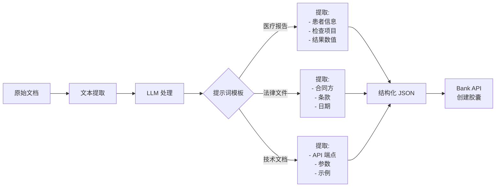

#### 示例：医疗报告提取

```typescript
// 客户端代码
const extractMedicalData = async (text: string) => {
    const prompt = `
请从以下医疗报告中提取结构化数据，返回 JSON 格式：

文本：
${text}

请提取：
1. patient_id: 患者 ID
2. test_date: 检查日期
3. test_type: 检查类型
4. results: 检查结果（数组）
5. doctor: 医生姓名
`;

    const response = await openai.chat.completions.create({
        model: "gpt-4",
        messages: [{ role: "user", content: prompt }],
        response_format: { type: "json_object" }
    });

    return JSON.parse(response.choices[0].message.content);
};

// 返回示例
{
    "patient_id": "P123456",
    "test_date": "2025-01-15",
    "test_type": "blood_test",
    "results": [
        {"item": "白细胞", "value": "5.2", "unit": "10^9/L", "normal": true},
        {"item": "红细胞", "value": "4.5", "unit": "10^12/L", "normal": true}
    ],
    "doctor": "张医生"
}
```

---

### 3. 文本提取

#### 保留的场景
```
✅ 简单文本文件
   - text/plain
   - text/html
   - text/csv
   - text/markdown
```

#### 外部化的场景
```
🔄 复杂文档格式
   - PDF (使用 pdf.js 或专门服务)
   - Word/Excel (使用 Apache Tika 或 Office API)
   - 图片 OCR (使用 Tesseract 或 Cloud Vision API)
```

---

### 4. 元数据生成

#### ✅ 保留在 Bank 内部

```rust
MetadataGenerator {
    // Bank 生成和验证
    filename: String,
    size: u64,
    mime_type: String,
    hash: String,  // SHA-256，用于完整性验证
    created_at: i64,
    modified_at: i64,
}
```

**原因**：
1. **安全性**：Bank 验证文件完整性（防止篡改）
2. **标准化**：确保所有胶囊的元数据格式一致
3. **轻量级**：元数据生成逻辑简单，性能开销小

---

## API 设计

### 方案 1: 完全托管 API (简单场景)

```
POST /v2/capsule/upload
Content-Type: multipart/form-data

Fields:
  - file: <binary>
  - owner_id: string
  - content_type: string (e.g., "medical.blood_test")
  - creator: string (optional)

Response:
{
    "success": true,
    "cap0_id": "cid:xxxxx",
    "cap1_id": "cid:yyyyy",
    "message": "Capsule created successfully"
}
```

**适用场景**：
- 快速原型开发
- 小文件（< 10MB）
- 简单文本文档

---

### 方案 2: 自助服务 API (生产推荐) ⭐

```
POST /v2/capsule/create
Content-Type: application/json

Request:
{
    "cap0": {
        "external_url": "https://s3.amazonaws.com/.../report.pdf",
        "origin_text_url": "https://s3.amazonaws.com/.../report.txt"  // 可选
    },
    "cap1": {
        "metadata": {
            "filename": "blood_test_report.pdf",
            "size": 1024000,
            "mime_type": "application/pdf",
            "hash": "sha256:abcd1234...",  // 可选，Bank 会验证
            "created_at": 1705334400,
            "modified_at": 1705334400
        },
        "bnf_data": {
            // 结构化数据（LLM 提取）
            "patient_id": "P123456",
            "test_date": "2025-01-15",
            "test_type": "blood_test",
            "results": [
                {
                    "item": "白细胞",
                    "value": "5.2",
                    "unit": "10^9/L",
                    "normal_range": "4.0-10.0",
                    "status": "normal"
                }
            ],
            "doctor": "张医生",
            "hospital": "中心医院"
        }
    },
    "owner_id": "user123",
    "content_type": "medical.blood_test",
    "policy_uri": "https://example.com/policy",
    "permissions": ["read", "share"],
    "creator": "hospital_system"
}

Response:
{
    "success": true,
    "cap0_id": "cid:xxxxx",
    "cap1_id": "cid:yyyyy",
    "storage_url": "https://s3.amazonaws.com/.../report.pdf",
    "created_at": 1705334400
}
```

**适用场景**：
- 生产环境
- 大文件支持
- 复杂文档类型
- 需要 LLM 处理

---

### 辅助 API 1: 预签名 URL 生成

```
POST /v2/storage/presigned-url
Content-Type: application/json

Request:
{
    "filename": "report.pdf",
    "content_type": "application/pdf",
    "size": 1024000,  // 字节
    "expires_in": 3600  // 秒，默认 1 小时
}

Response:
{
    "upload_url": "https://s3.amazonaws.com/bucket/key?signature=...",
    "object_key": "user123/2025-01-15/report.pdf",
    "expires_at": 1705338000,
    "max_size": 104857600  // 100 MB
}
```

---

### 辅助 API 2: 文件完整性验证

```
POST /v2/capsule/verify
Content-Type: application/json

Request:
{
    "cap0_id": "cid:xxxxx",
    "expected_hash": "sha256:abcd1234..."
}

Response:
{
    "valid": true,
    "actual_hash": "sha256:abcd1234...",
    "verified_at": 1705334400
}
```

---

## 组件职责划分

### ✅ Bank 服务负责

```
核心职责：
✅ Cap0 + Cap1 封装和解封
✅ 系统密钥管理
✅ 加密和解密
✅ 元数据生成和验证
✅ 数据库存储和索引
✅ 权限管理
✅ 访问控制
```

### 🔄 客户端/外部服务负责

```
扩展职责：
🔄 文件上传到 S3
🔄 复杂格式文本提取（PDF、Word）
🔄 OCR 图片识别
🔄 LLM 结构化数据提取
🔄 文档预处理
```

### 📊 职责对比表

| 功能 | 当前方案 | 推荐方案 | 原因 |
|------|---------|---------|------|
| S3 上传 | Bank 中转 | 客户端直传 | 性能、带宽 |
| 文本提取（简单） | Bank | Bank | 轻量级、标准化 |
| 文本提取（复杂） | Bank | 外部服务 | 专业性、扩展性 |
| BNF 解析 | Bank | LLM | 理解能力、灵活性 |
| 元数据生成 | Bank | Bank | 安全、标准化 |
| Cap0/Cap1 封装 | Bank | Bank | 核心业务 |
| 密钥管理 | Bank | Bank | 安全核心 |

---

## 完整流程示例

### 场景：医疗报告上传

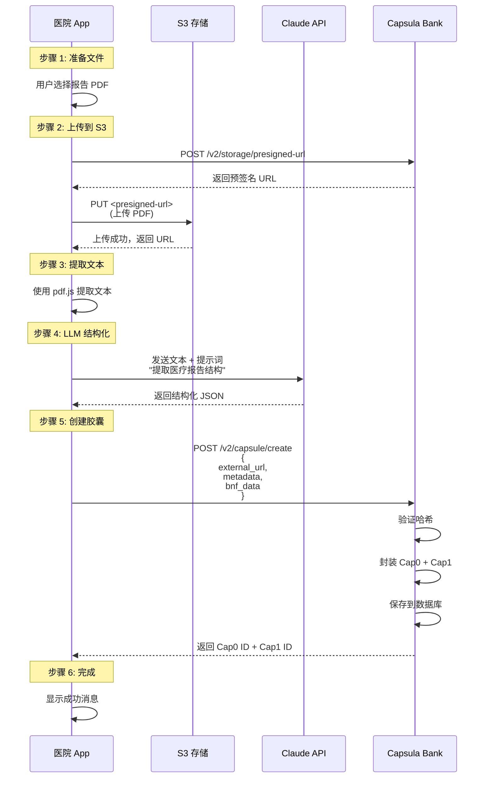

---

## 迁移策略

### 阶段 1: 保持兼容（当前）
```
✅ V1 API: 保持不变
✅ V2 Upload API: 完全托管模式
```

### 阶段 2: 添加新 API（推荐）
```
🆕 POST /v2/capsule/create
🆕 POST /v2/storage/presigned-url
🆕 POST /v2/capsule/verify
```

### 阶段 3: 逐步迁移
```
📱 客户端更新：使用新 API
📊 监控：对比两种模式的性能
🔄 优化：根据使用情况调整
```

### 阶段 4: 废弃旧 API（可选）
```
⚠️ 标记 V2 Upload 为 deprecated
📢 通知客户端迁移
🗑️ 在合适的版本移除
```

---

## 总结

### 核心设计原则

```
1. 关注点分离
   Bank 专注胶囊管理，文件处理交给专业服务

2. 性能优先
   客户端直连 S3，减少中转延迟

3. 灵活扩展
   支持任意 LLM 和文档类型

4. 安全可靠
   Bank 验证完整性，确保数据安全
```

### 推荐的技术栈

```
客户端：
- 文件上传: AWS SDK / MinIO Client
- PDF 提取: pdf.js / pdfplumber
- LLM 调用: OpenAI SDK / Anthropic SDK

Bank 服务：
- 核心: Rust + Axum
- 加密: capsula-core
- 存储: SurrealDB
- 缓存: Redis (可选)

外部服务：
- 对象存储: S3 / MinIO / Cloudflare R2
- LLM: OpenAI / Claude / 本地模型
- OCR: Tesseract / Cloud Vision API
```

---

## 参考资料

- [Capsula Core 文档](../capsula-core/README.md)
- [API 版本化说明](./API_VERSIONING.md)
- [S3 预签名 URL 文档](https://docs.aws.amazon.com/AmazonS3/latest/userguide/PresignedUrlUploadObject.html)
- [OpenAI Function Calling](https://platform.openai.com/docs/guides/function-calling)
