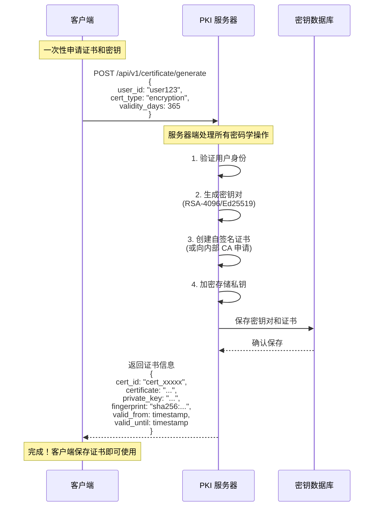
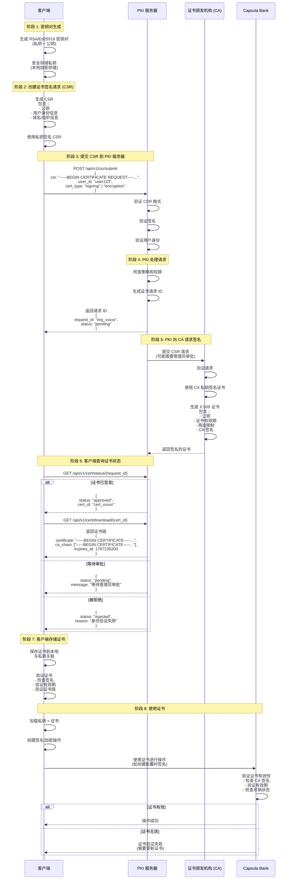
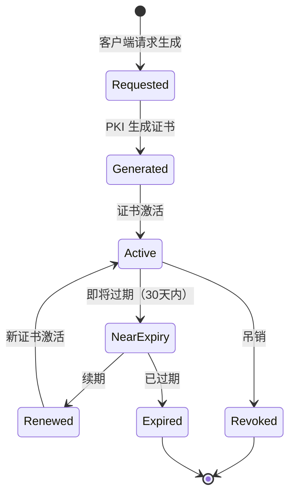
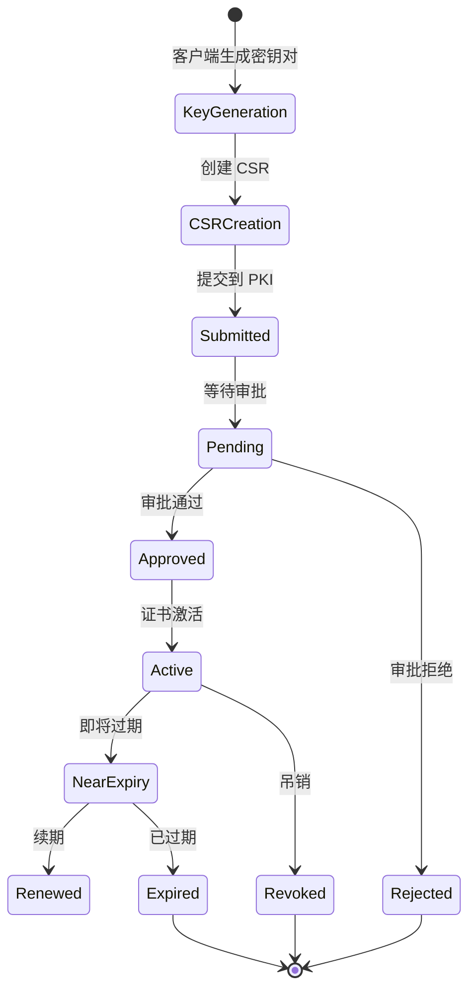
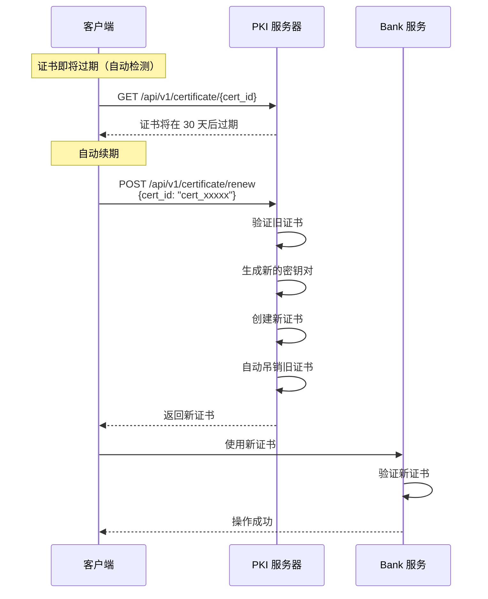
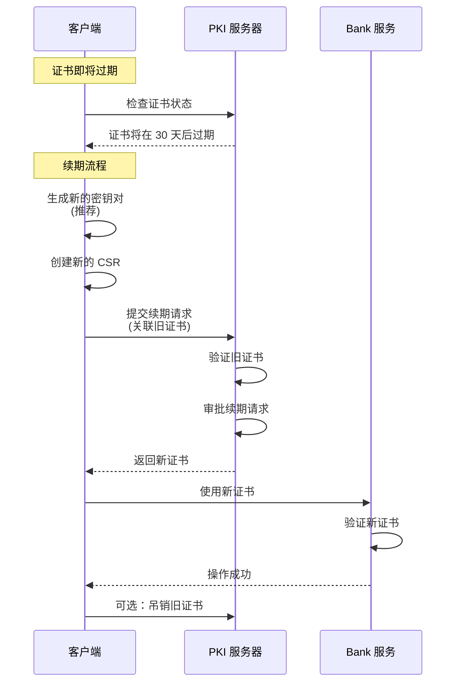
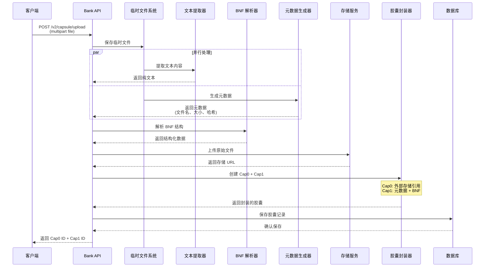
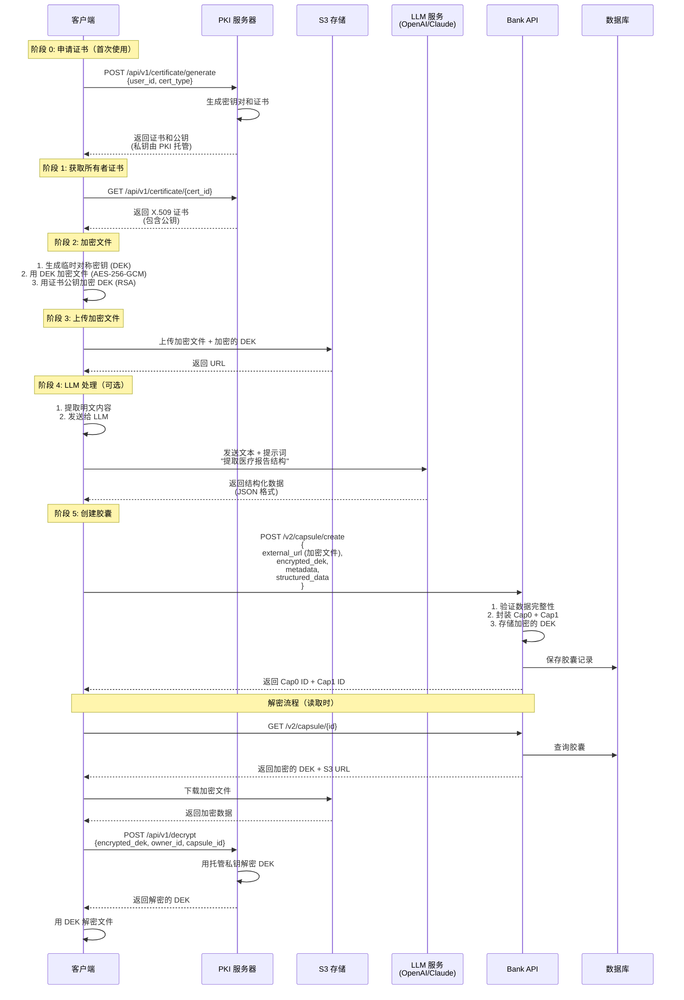
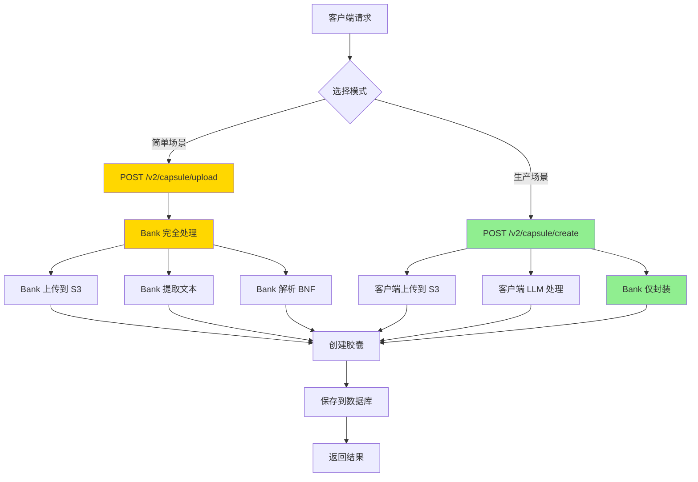

# Capsula Bank 架构设计文档

## 目录
- [PKI 证书申请流程](#pki-证书申请流程)
- [系统架构概览](#系统架构概览)
- [当前实现流程](#当前实现流程)
- [推荐架构流程](#推荐架构流程)

---

## PKI 证书申请流程

### 方案 1: 极简方案（推荐）⭐

**设计理念**：客户端零密码学操作，一次 API 调用完成所有流程。



**极简方案 API 设计**：

```typescript
// 请求
POST /api/v1/certificate/generate
Content-Type: application/json
Authorization: Bearer <auth_token>

{
    "user_id": "user123",
    "cert_type": "encryption",  // 或 "signing"
    "validity_days": 365        // 可选，默认 365 天
}

// 响应
{
    "cert_id": "cert_xxxxx",
    "certificate": "-----BEGIN CERTIFICATE-----\n...",
    "public_key": "-----BEGIN PUBLIC KEY-----\n...",
    "fingerprint": "sha256:abcd1234...",
    "valid_from": 1705334400,
    "valid_until": 1736870400,
    "algorithm": "RSA-4096",
    "key_usage": ["keyEncipherment", "dataEncipherment"]
}
```

**极简方案优势**：

```
✅ 客户端零密码学操作
   - 无需生成密钥对
   - 无需创建 CSR
   - 无需处理证书格式

✅ 一次 API 调用完成
   - 同步返回结果
   - 无需轮询状态
   - 即时可用

✅ 服务器端安全托管
   - 私钥加密存储
   - 统一密钥管理
   - 支持密钥恢复

✅ 简化客户端开发
   - 降低技术门槛
   - 减少错误可能
   - 加快集成速度
```

---

### 方案 2: 标准方案（传统 PKI 流程）

**设计理念**：遵循传统 PKI 标准，客户端管理密钥对。



**标准方案特点**：

```
✅ 符合 PKI 标准
   - 遵循 X.509 规范
   - 支持证书链验证
   - 兼容 OpenSSL 工具

✅ 客户端掌控私钥
   - 私钥不离开客户端
   - 符合零信任架构
   - 适合高安全场景

❌ 实现复杂
   - 需要客户端密码学库
   - 需要处理证书格式
   - 需要管理密钥存储

❌ 集成门槛高
   - 需要理解 PKI 概念
   - 需要处理多步流程
   - 容易出错
```

---


### PKI API 端点汇总

#### 极简方案 API

```
POST   /api/v1/certificate/generate      - 一次性生成证书和密钥（推荐）
GET    /api/v1/certificate/{cert_id}     - 获取证书信息
GET    /api/v1/certificate/list          - 列出用户的所有证书
POST   /api/v1/certificate/revoke        - 吊销证书
POST   /api/v1/decrypt                   - 解密 DEK（使用托管私钥）
GET    /api/v1/verify/{fingerprint}      - 验证证书有效性
```

#### 标准方案 API

```
POST   /api/v1/csr/submit                - 提交证书签名请求（CSR）
GET    /api/v1/cert/status/{request_id}  - 查询证书申请状态
GET    /api/v1/cert/download/{cert_id}   - 下载签名的证书
GET    /api/v1/cert/list                 - 列出用户的证书
POST   /api/v1/cert/revoke               - 吊销证书
GET    /api/v1/cert/verify               - 验证证书有效性
GET    /api/v1/ca/chain                  - 获取 CA 证书链
```

#### 通用 API

```
GET    /api/v1/ca/certificate            - 获取 CA 根证书
GET    /api/v1/health                    - 健康检查
GET    /api/v1/info                      - 服务信息
```

### 证书生命周期管理

#### 极简方案生命周期



**极简方案特点**：
- 即时生成，无需等待审批
- 自动续期机制
- 统一密钥管理

#### 标准方案生命周期



**标准方案特点**：
- 需要审批流程
- 客户端管理密钥
- 符合传统 PKI 标准

### 证书更新流程

#### 极简方案更新流程



**极简方案续期 API**：

```typescript
// 续期请求
POST /api/v1/certificate/renew
{
    "cert_id": "cert_xxxxx",
    "validity_days": 365  // 可选
}

// 响应
{
    "old_cert_id": "cert_xxxxx",
    "new_cert_id": "cert_yyyyy",
    "certificate": "-----BEGIN CERTIFICATE-----...",
    "public_key": "-----BEGIN PUBLIC KEY-----...",
    "valid_from": 1705334400,
    "valid_until": 1736870400,
    "revoked_old_cert": true
}
```

#### 标准方案更新流程



---

## 系统架构概览

### 核心概念

**Capsula Bank** 是一个胶囊管理服务，负责：
1. 接收和管理加密数据胶囊（Capsule）
2. 支持两层数据结构：Cap0（外部存储）+ Cap1（内联元数据）
3. 使用银行系统密钥进行统一加密
4. 提供权限管理和访问控制

---

## 当前实现流程

### V2 Upload API - 完全托管模式



### 当前流程的问题

```
❌ 问题 1: 文件中转
   客户端 → Bank 服务器 → S3
   导致带宽浪费和延迟增加

❌ 问题 2: BNF 解析局限
   SimpleBnfParser 只能处理简单语法
   无法理解自然语言文档

❌ 问题 3: 扩展性差
   新增文档类型需要修改 Bank 代码
   PDF、Word 等格式需要重量级依赖

❌ 问题 4: 性能瓶颈
   所有处理都在 Bank 服务器完成
   大文件上传占用服务器资源
```

---

## 推荐架构流程

### 方案 A: 完全外部化（生产推荐）⭐

**使用极简 PKI 方案**：客户端零密码学操作，服务器托管密钥。



**方案 A 特点**：
- ✅ 使用极简 PKI 方案（服务器托管密钥）
- ✅ 客户端零密码学操作（除了文件加密）
- ✅ 端到端加密（S3 只存储密文）
- ✅ 快速集成（< 1 小时）
- ✅ 支持密钥恢复

### 方案 B: 混合模式（灵活）



---


